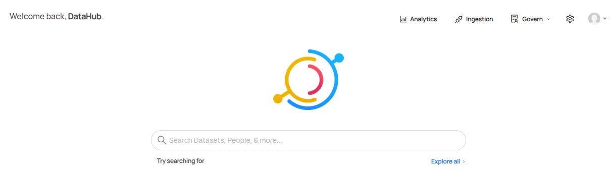
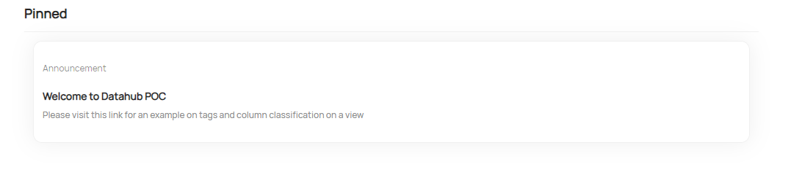
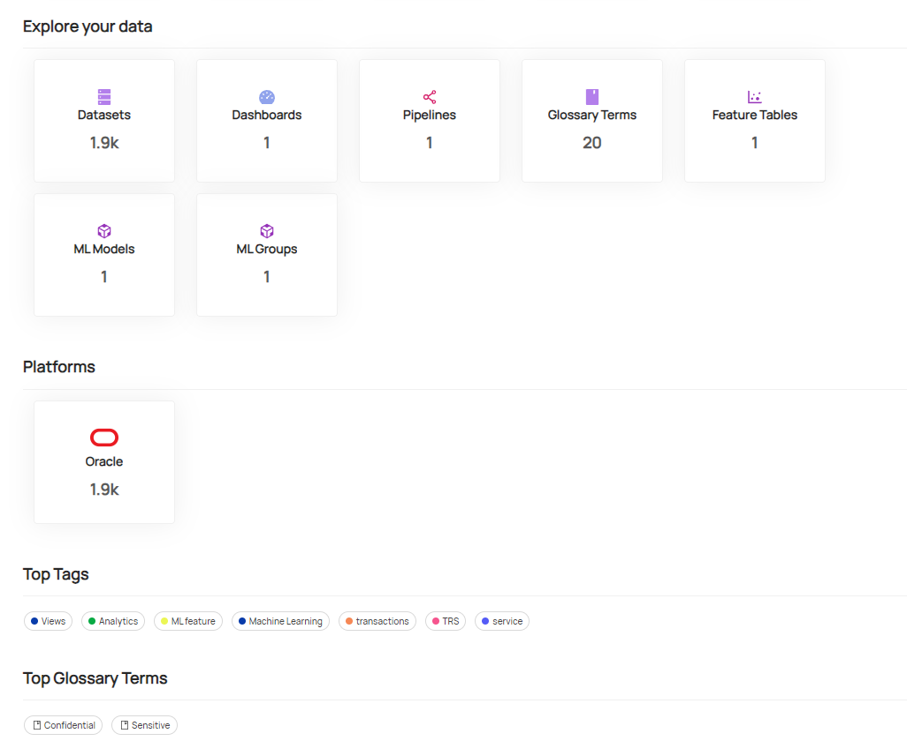
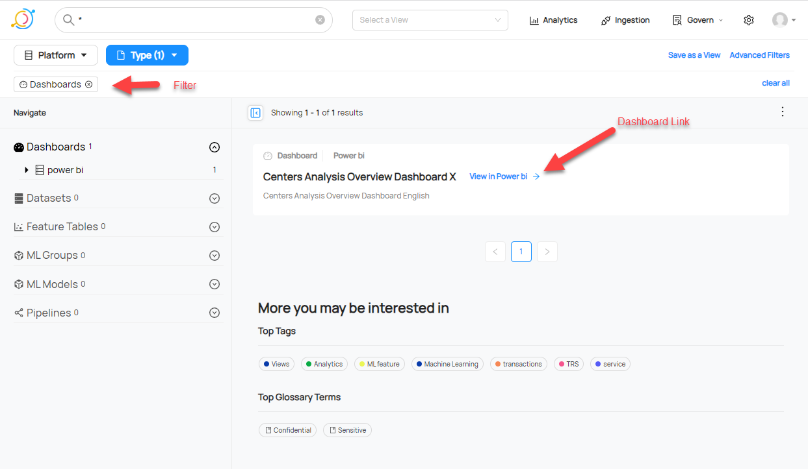
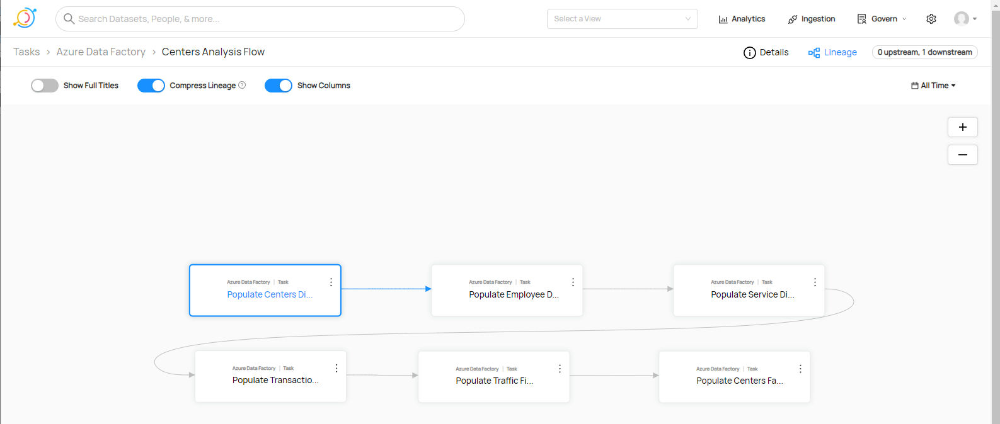
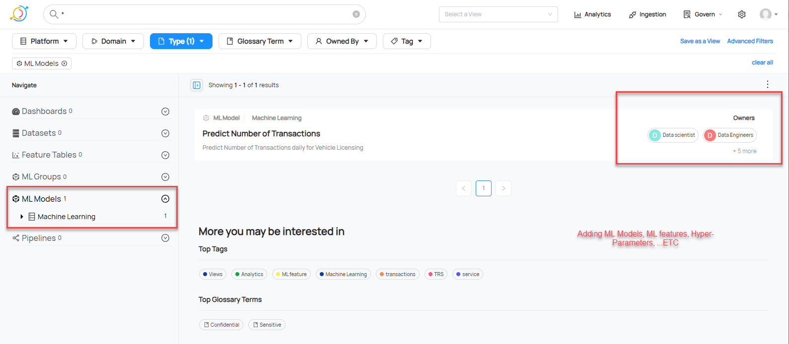
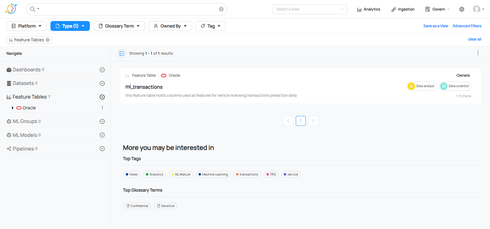
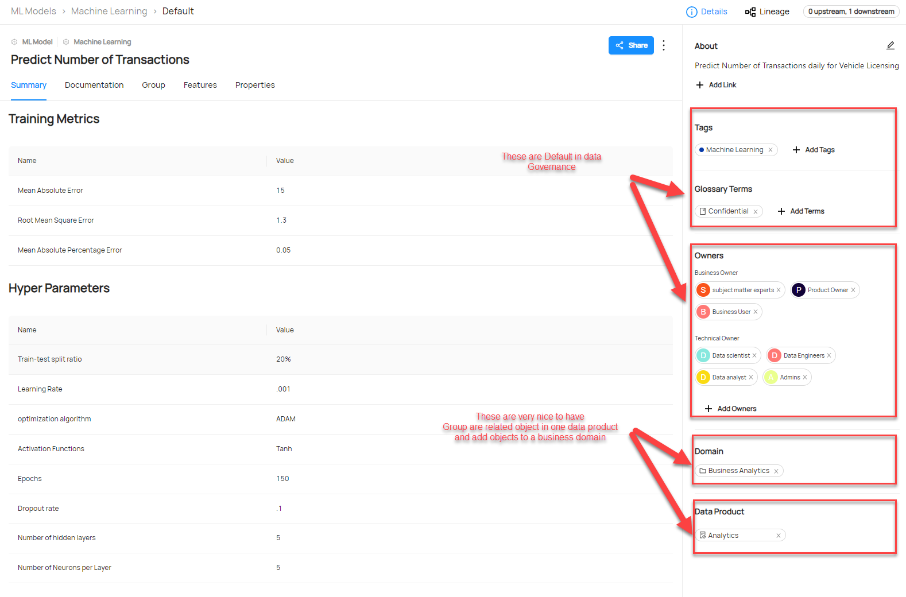

# DataHub-Examples
Examples on Data Governance Platform

I used Python, datahub API, datahub GraphQL, and datahub CLI tool to create the following:

	-Get missing tables from an ingestion using the datahub built in GraphQL.
	
	-Get missing tables from an ingestion using the datahub CLI.
	
	-Create a post on the home Page.
	
	-Create Data flow and datajobs with lineage visualization.
	
	-Create Machine Learning Table and features.
	
	-Add Machine Learning Model, Model group, Hyper-Parameters, and Model Training Metrics.
	
	-Add Dashboard, Charts, and Link to The Dashboard.
	
	Images of the output:- 
	

	